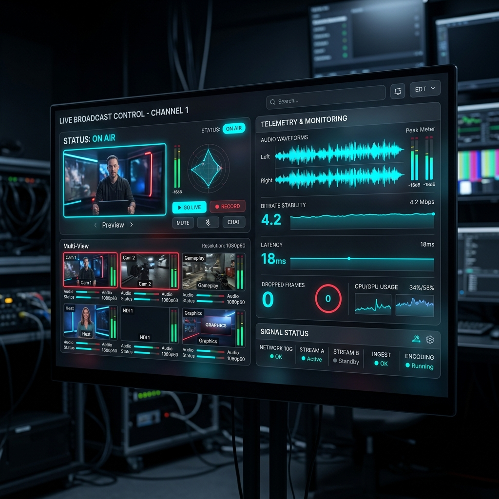

# The Control Room



An agent crew that finds out why a live stream is breaking, before the on-call engineer has finished reading the alert.

Built on Gemini and Google Cloud Agent Builder (ADK), against ClickHouse.

---

## Highlights & Interactive Features

- **Interactive Scenario Switcher**: Choose from 6 planted fault archetypes (`shield_eviction`, `isp_peering`, `encoder_corruption`, `packager_manifest`, `player_regression`, `regional_pop`) directly in the Web UI.
- **Broadcast Web Audio Alert System**: Synthesized audio klaxon & step chimes built with Web Audio API.
- **Explanatory Power Attribution**: 93.9% Top-1 (98.5% Top-2) ground-truth accuracy over 66 datasets, against three naive QoE dashboards that score 0.0%, 0.0% and 37.9%.
- **ClickHouse MCP on the critical path**: every read in the six-step pipeline is executed by the official `mcp-clickhouse` server against ClickHouse Cloud — not just attached for chat.
- **Zero-Credential 1-Click Execution**: Embedded ClickHouse (`chdb`) with seeded 250k telemetry heartbeats, for reviewers with no account.

## The problem

During a live event, a quality alert says one thing: *rebuffering is up*. It does not say which CDN, which region, which device class, or which of the four things that changed in the last hour caused it. On-call engineers pivot through dashboards for 20 to 40 minutes while viewers leave. For a 2-million-concurrent broadcast, every minute of that is measurable churn and forgone ad revenue.

The data to answer it already exists — billions of player heartbeats. Nobody can query it fast enough under pressure.

## What this does

Six agents run in a fixed order, every time:

| | Agent | What it does |
|---|---|---|
| 1 | **Watcher** | z-score sweep over a per-minute rollup, then the same sweep per slice against each slice's own baseline. Incident, or normal variance? |
| 2 | **Diagnostician** | Explanatory-power attribution across six dimensions, then drills into individual sessions in the culprit slice. |
| 3 | **Eyewitness** | Gemini *looks at frames* from the affected renditions, alongside the error-code profile for the whole culprit slice. Clean picture with stalls means delivery. Macroblocking means encoder. A clean picture contained inside one player build means client. This decides who gets paged. |
| 4 | **Impact** | Sessions hit, abandons, watch-time lost, revenue at risk. |
| 5 | **Action** | Remediation the engineer can execute in two minutes, plus the viewer-facing post. |
| 6 | **Continuity** | Re-measures the culprit slice. An incident closes because the numbers came back, not because an agent wrote a plan. |

Every step — including the exact SQL and rows scanned — is written back to ClickHouse, so any run can be replayed after the fact.

## The part that matters: it's deterministic

Gemini decides **what the evidence means**. It never decides **which evidence to collect** on the critical path.

Every read in the six steps is executed by the official ClickHouse MCP server (`mcp-clickhouse`), and every one of those queries ships in this repo under `sql/queries/`. Those two facts are the whole design, and they are not in tension:

- **The MCP server is the transport.** It is what connects to ClickHouse Cloud, runs the statement and returns the rows — the integration ClickHouse publishes and maintains, rather than a bespoke driver call buried in application code. `controlroom/mcp_client.py` holds the stdio session; `controlroom/ch.py` routes every `run_template` through it.
- **`sql/queries/` is the decision.** Which query runs, over which window, for which dimension, is fixed by `pipeline.py` before any model is asked anything. Re-run a `run_id` against the same window and you get the same queries and the same culprit.

So a model never picks the evidence — it is handed rows it did not select — while the thing actually talking to ClickHouse is ClickHouse's own MCP server. That is the difference between a demo and something you would let touch a live broadcast.

The culprit dimension does come back from a model, and it is about to be substituted into SQL, so it is checked against a six-value whitelist and every literal is escaped before anything reaches the server (`ch.bind_params`). A hallucinated culprit raises, it does not rewrite a statement.

The same MCP session is exposed to the ADK agent for open-ended follow-up ("was BLR1 affected too?"), where a wrong query costs nothing and the pipeline's verdict is already recorded. See `controlroom/agents.py`.

Writes — schema, the run log, the incident record — go over `clickhouse-connect`, because the MCP server is read-only by design. Both connections are live at once and each does the half it can.

## Architecture

```
player telemetry ──▶ ClickHouse Cloud
                       ├── playback_events   raw, MergeTree, 90-day TTL
                       ├── qoe_1m            AggregatingMergeTree rollup ◀── detection reads here
                       ├── agent_runs        every step, every query, replayable
                       └── incidents
                          ▲            ▲
             reads        │            │  writes
   ┌──────────────────────┘            └──────────── clickhouse-connect
   │                                                 (schema + run log; MCP is read-only)
   │
  ClickHouse MCP server (mcp-clickhouse, stdio)
   ▲                                  ▲
   │ every query on the critical      │ open-ended follow-ups
   │ path, all from sql/queries/      │ ("was BLR1 affected too?")
   │                                  │
  pipeline (6 fixed steps) ◀── open_control_room ── ADK root_agent
   ├── Gemini 2.5 Flash   watcher verdict                (Agent Engine)
   ├── Gemini 2.5 Pro     diagnosis, action
   └── Gemini 2.5 Pro     vision — frame inspection
   │
   ├── evals/run_eval.py  ground-truth accuracy
   ▼
  FastAPI + SSE ──▶ Control Room UI (Cloud Run)
```

## Google Cloud and ClickHouse, actually called

Not name-dropped in a README — imported and executed:

- `controlroom/mcp_client.py` — a stdio session against the official `mcp-clickhouse` server. Every read on the six-step path goes through its query tool. Tool names are resolved from the server's own `tools/list` rather than hard-coded, because the query tool was renamed (`run_select_query` → `run_query`) between releases.
- `controlroom/ch.py` — routes `run_template` through that MCP session, and `clickhouse-connect` for the writes MCP cannot do. `/api/mode` and `/healthz` report which transport is live, so the header never claims a connection the instance does not have.
- `controlroom/pipeline.py` — `google.genai` calls to Gemini 2.5 Pro/Flash on Vertex AI, structured JSON responses.
- `controlroom/eyewitness.py` — Gemini multimodal, real image bytes passed as `types.Part.from_bytes`.
- `controlroom/agents.py` — ADK `Agent` + `McpToolset` on the same MCP server, for follow-up questions.
- Deployed on Cloud Run; agent deployable to Vertex AI Agent Engine via `adk deploy agent_engine`.

Check it rather than take it on faith — `/healthz` and `/api/mode` both name the live transport:

```bash
curl -s $URL/healthz    # {"status":"ok","events_loaded":5000000,"transport":"mcp"}
curl -s $URL/api/mode   # {"database":"ClickHouse Cloud via MCP","mcp_server":"mcp-clickhouse",...}
```

## Run it with no account, no keys, one command

```bash
git clone <this repo> && cd control-room
./scripts/demo.sh
```

Open http://localhost:8080 and press **Roll cameras**. The full six-agent run executes against an embedded ClickHouse (`chdb` — the same engine, compiled in-process) seeded with 250k events, and the reasoning steps fall back to rule-based stubs.

Both substitutions are labelled in the header bar, in `/api/mode`, and in the `model` column of every logged step. Nothing pretends to be Gemini that isn't. The point is that a reviewer can see the whole product work before deciding whether to plug in credentials.

## Run it for real

```bash
cp .env.example .env        # ClickHouse Cloud + GCP project
./scripts/bootstrap.sh      # schema, 5M events, server on :8080
```

With `CLICKHOUSE_HOST` set, reads switch to the MCP transport automatically. Confirm it before anything else:

```bash
curl -s localhost:8080/healthz
# {"status":"ok","events_loaded":5000000,"transport":"mcp"}
```

`transport` must read `mcp`. If it says `embedded`, `.env` was not loaded; if it says `direct`, `CLICKHOUSE_TRANSPORT=direct` is set — that path exists for debugging the MCP layer and is not what the product runs.

Talk to the agent instead:

```bash
adk web controlroom          # local chat UI
adk deploy agent_engine --project $GOOGLE_CLOUD_PROJECT --region $GOOGLE_CLOUD_LOCATION controlroom
```

Deploy the dashboard:

```bash
gcloud run deploy control-room --source . \
  --region $GOOGLE_CLOUD_LOCATION --allow-unauthenticated \
  --set-env-vars "GOOGLE_GENAI_USE_VERTEXAI=TRUE,GOOGLE_CLOUD_PROJECT=$GOOGLE_CLOUD_PROJECT,GOOGLE_CLOUD_LOCATION=$GOOGLE_CLOUD_LOCATION,CLICKHOUSE_HOST=$CLICKHOUSE_HOST,CLICKHOUSE_USER=$CLICKHOUSE_USER,CLICKHOUSE_SECURE=true,CLICKHOUSE_DATABASE=control_room" \
  --set-secrets "CLICKHOUSE_PASSWORD=clickhouse-password:latest"
```

The service account needs `roles/aiplatform.user` for Vertex AI. Put the ClickHouse password in Secret Manager rather than `--set-env-vars`, since Cloud Run environment variables are readable by anyone with console access to the service.

## Does it actually work? Measure it.

Claiming an agent diagnoses incidents is easy. `evals/run_eval.py` scores it against ground truth on six fault archetypes, alongside three baselines that represent what dashboards and naive LLM prompts actually do. It runs on an embedded ClickHouse — no cloud account, no credentials:

```bash
pip install chdb numpy
python evals/run_eval.py --trials 11
```

Eleven seed bases × six archetypes = 66 datasets:

```
strategy                   top-1       top-2
worst_qoe              0/66   0.0%     0/66   0.0%
largest_total          0/66   0.0%     0/66   0.0%
biggest_delta         25/66  37.9%    29/66  43.9%  ███████
control_room          62/66  93.9%    65/66  98.5%  ██████████████████

                              fitted seeds              held-out seeds
biggest_delta        7/18  38.9%  top-2  44.4%   18/48  37.5%  top-2  43.8%
control_room        17/18  94.4%  top-2 100.0%   45/48  93.8%  top-2  97.9%

diagnosis latency: median 311 ms over 6 dimensions
```

The tiebreak weight in `controlroom/attribution.py` was fitted on the first three seed bases. The other eight are held out and scored separately, because accuracy measured on the seeds you fitted on is not a result. The gap here is 0.6 points, which is the point of showing both columns — if fitting had bought anything, it would show up as a large one.

Every dataset contains a chronic-but-innocent slice: BSNL viewers pinned to the bottom of the ABR ladder, who stall constantly and always have. They are the worst-looking rows in the table and they are never the answer. Two of the three baselines blame them, or the bottom rung of the ladder they sit on, on **all 66 runs** — which is exactly the 2am mistake this system exists to prevent.

### Naming the slice is not the whole job

A run that names the right slice and pages the wrong team has not helped anyone at 2am. Over one full pass of all six archetypes through the running server, with no credentials and the offline reasoning stubs:

| scenario | culprit named | team paged |
|---|---|---|
| `shield_eviction` | `cdn=edgecast` ✓ | delivery ✓ |
| `isp_peering` | `isp=Airtel` ✓ | delivery ✓ |
| `encoder_corruption` | `rendition=1080p60` ✓ | encoder ✓ |
| `packager_manifest` | `cdn=fastly` ✓ | packager ✓ |
| `player_regression` | `player_version=4.12.0` ✓ | client ✓ |
| `regional_pop` | `region=DE-BE` ✓ | delivery ✓ |

Routing reads the error-code profile by *share* over the whole culprit slice, not by whether a code appeared in a sample. Every slice throws a scattering of every code, and errors are about one event in a hundred, so a domain decided from the twenty worst-stalling sessions is decided by luck.

### Detection is a gate, so it gets measured too

The comparison above starts at `blame.sql`, which quietly assumes step 1 already said yes. It is a gate: when the Watcher says "normal variance", nothing downstream runs and attribution accuracy is beside the point. So it is measured on its own:

```bash
python evals/run_eval.py --detection --trials 3
```

```
scenario                  global sweep   + slice sweep
shield_eviction                3/3             3/3
isp_peering                    3/3             3/3
encoder_corruption             2/3             3/3
packager_manifest              3/3             3/3
player_regression              3/3             3/3
regional_pop                   2/3             2/3
------------------------------------------------------
all                           16/18            17/18
```

A z-score on the all-up average only sees a fault big enough to move the all-up average. An encoder emitting corrupt slices on one rendition hurts a fifth of the audience while lifting the global number a few percent — normal variance — so the global sweep dropped that incident before anything else got to look at it. That is the same blind spot as the QoE dashboards this system exists to replace, reproduced in its own step 1.

So the Watcher repeats the sweep per slice, against each slice's own baseline, and calls an incident when a slice runs above its own baseline for the whole window (`sql/queries/detect_slice.sql`). The statistic is the mean z across the window, not the peak: on healthy data some slice's *peak* z is routinely 5 to 19, because one unlucky minute is all it takes.

`regional_pop` still misses one run in three, and the reason is the same one that makes it the weakest archetype for attribution — see below.

### Accuracy is meaningless without fault size

A single accuracy number says nothing on its own, because it depends entirely on how hard the planted fault bites. So the eval reports the whole curve:

```bash
python evals/run_eval.py --sweep-severity --trials 5
```

| fault severity | worst_qoe | largest_total | biggest_delta | control_room |
|---|---|---|---|---|
| 0.000 | 0.0% | 0.0% | 30.0% | 80.0% |
| 0.005 | 0.0% | 0.0% | 33.3% | 90.0% |
| **0.010** (default) | 0.0% | 0.0% | 40.0% | **96.7%** |
| 0.020 | 0.0% | 0.0% | 46.7% | 100.0% |
| 0.040 | 0.0% | 0.0% | 56.7% | 100.0% |

Severity is the extra probability that an event inside the fault slice becomes a stall; 30 datasets per row. The bottom row is the noise floor, not a score: at 0.000 the fault slice only ever gets *longer* stalls on the stalls it would have had anyway, so for a small slice like `region=DE-BE` — 6% of traffic — the incident window can show it stalling less than its own baseline. Nothing can attribute a cause the data does not contain, and a benchmark run there measures luck. What the curve does show is that the naive panels never work at any severity, while explanatory power degrades gracefully toward the floor.

### Where it fails

Per archetype, across all 66 datasets:

| scenario | top-1 | top-2 |
|---|---|---|
| `shield_eviction` | 11/11 | 11/11 |
| `isp_peering` | 11/11 | 11/11 |
| `encoder_corruption` | 11/11 | 11/11 |
| `packager_manifest` | 11/11 | 11/11 |
| `player_regression` | 10/11 | 11/11 |
| `regional_pop` | 8/11 | 10/11 |

Every miss is the same failure and it is worth stating plainly: the ranking named the cohort that suffered most instead of the fault that caused it. In two of the three `regional_pop` misses the correct slice came second and went into the page as the secondary, which is why top-2 is reported alongside top-1 — the on-call engineer received the right information, ranked wrong. In the third it did not, and that is a real miss.

`regional_pop` is where every weakness in this system concentrates, and the reason is structural rather than algorithmic. `region=DE-BE` is the smallest slice any archetype plants a fault in — 6% of traffic, about 80 sessions a minute — so its per-minute average is noisy, which inflates its own baseline sigma and drags its z-score down however long it stays bad. That costs it twice: the Watcher misses it about a third of the time, and when the Diagnostician does see it, its excess is close enough to noise that the tiebreak has little to work with.

Two things were tried and rejected rather than left in. Turning up the fault does not fix detection — at 0.02 severity `regional_pop` still misses, and `encoder_corruption` gets *worse* — which is what established this is a detector property, not a data one. And adding "share of the window spent above baseline" as a second detection statistic does not separate: innocent slices sit at 0.85 to 1.00 during any real incident, because a genuine fault drags its neighbours up with it. The note is left in `sql/queries/detect_slice.sql` so the next person does not spend an afternoon on it.

### Why explanatory power

Severity does not identify a root cause. Containment does.

If a bad player release is the fault, then essentially *all* the excess stall time lives inside that version — explanatory power near 1. The device class that suffers most is only a slice of the affected population, so it explains a fraction. Ranking on "how much of the fault does this slice contain" separates the cause from the cohort that merely hurts.

When two slices are both largely contained — a CDN fault and the smart TVs it hits hardest — Jensen-Shannon divergence between baseline and incident share breaks the tie. The SQL is in `sql/queries/blame.sql`, roughly 40 lines, and it runs in half a second.

One detail that matters: `controlroom/attribution.py` holds the scoring formula, and both the pipeline and the eval import it. If the eval scored one formula while production ran another, the number above would be fiction.

### And the SQL itself

```bash
python tests/test_sql.py
```

Creates the schema, fires the materialized view, inserts 300k events with one planted fault, and asserts the ranking finds it:

```
cdn              → edgecast         EP=0.968 surprise=0.00549
device_type      → smart_tv         EP=0.667 surprise=0.00039
rendition        → 360p             EP=0.566 surprise=0.00002
culprit: cdn=edgecast

sessions_hit=4433 viewers_hit=4116 stall_minutes=58.2 rage_quits=3
```

`edgecast` is the fault and `smart_tv` is the cohort it hits hardest. Both are largely contained, which is exactly the case explanatory power alone cannot settle; the order comes from `edgecast` having 14× the surprise. The decoy `360p` sits below both despite being the worst-looking rendition in the table.

## The dataset

`data/generate_events.py` produces realistic player telemetry — ABR ladder walks, buffer health, error codes, ad completions — and injects one of six fault archetypes:

```bash
python data/generate_events.py --list
```

| scenario | fault | who should be paged |
|---|---|---|
| `shield_eviction` | origin shield evicting segments in one POP | delivery |
| `isp_peering` | peering congestion mid-event | delivery |
| `encoder_corruption` | corrupt slices on the top rendition | encoder |
| `packager_manifest` | stale manifest published | packager |
| `player_regression` | player release regressing buffer management | client |
| `regional_pop` | one edge POP degraded, all CDNs fine | delivery |

Faults are deliberately subtle. One planted fault raises the stall rate inside its slice by one percentage point, and adds a few hundred milliseconds to the stalls that happen — against a decoy that stalls 30% of the time and always has. The cohort the fault hits hardest gets a further bump, which is what keeps *the cause* and *who suffers most* two different slices, and the whole problem worth solving. Two constants at the top of `data/generate_events.py` set both, for all six archetypes; there are no per-scenario knobs, so no archetype can be quietly turned up until it passes.

```bash
python data/generate_events.py --fault-severity 0.005 --scenario regional_pop
```

Nothing about the fault is passed to the agents. They read it out of the data.

## Layout

```
sql/01_schema.sql        tables, rollup MV, run log
sql/queries/             the only SQL on the critical path
sql/queries/detect.sql       global z-score sweep
sql/queries/detect_slice.sql per-slice sweep, for faults the global one hides
sql/queries/blame.sql        explanatory-power attribution
sql/queries/forensics.sql    session drill-down + impact
sql/queries/error_profile.sql dominant error codes in the culprit slice
data/scenarios.py        six fault archetypes + the confounder
data/generate_events.py  telemetry generator
controlroom/pipeline.py  the six fixed steps
controlroom/attribution.py  the ranking formula, shared by pipeline and eval
controlroom/llm.py       Gemini, plus labelled offline fallbacks
controlroom/mcp_client.py   stdio session on the official ClickHouse MCP server
controlroom/agents.py    ADK agent on the same MCP server, for follow-ups
controlroom/eyewitness.py  Gemini vision on stream frames
controlroom/server.py    FastAPI, SSE
web/index.html           the control room
evals/run_eval.py        accuracy vs ground truth, against three baselines
tests/test_sql.py        SQL verified against a real ClickHouse engine
scripts/demo.sh          zero-credential run
```

## License

MIT. See [LICENSE](LICENSE).
